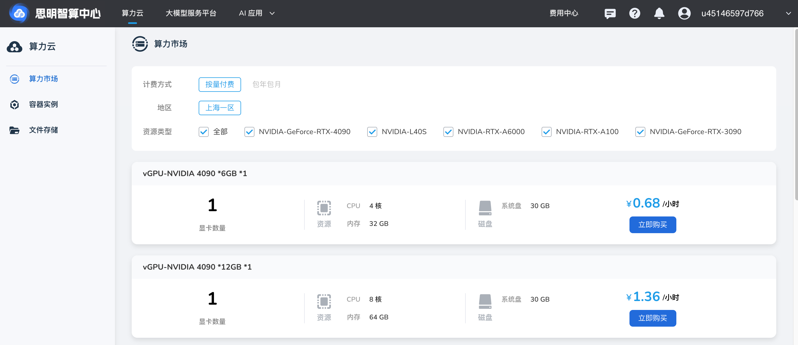

---
hide:
  - toc
---

# 注册账号

思明智算中心 是 一套企业级 AI 算力平台，基于云原生架构打造，
集算力运营、模型广场、模型部署、推理及应用构建于一体，覆盖 AI 全流程。
平台具备高效的异构 GPU 调度、灵活的资源管理和完善的安全运维机制，
帮助用户以更低成本、更高效率运行大模型与 AI 应用。

在统一的 Web 界面中，用户可完成模型管理、API 调用、向量检索配置及多类型 AI 应用创建，
并享有透明计费与可视化运营支持，为企业与开发者提供一站式 AI 生产力解决方案。

!!! tip

    思明智算中心 让算力更自由。
    [注册并体验 思明区人工智能产业公共服务平台](https://portal.smdata.com.cn/login/){ .md-button }
    
    思明区人工智能产业公共服务平台 是综合性算力运维平台，
    整合云原生能力，为用户提供模型服务，构建智能问答体系，化算力为“算利”。

    建议从 PC 端使用 Chrome 浏览器进行访问。

<abbr title="DaoCloud Runs Intelligence">d.run</abbr> 支持以手机、邮箱注册账号。

1. 在登录窗口点击 **注册**
2. 填写用户名、邮箱、手机号，收到并填写验证码后，勾选：

    ☑️ **我已阅读并同意[《平台服务协议》](./service/index.md)**

    !!! tip

        每个邮箱只能注册一次。
        如果提示邮箱已注册，可以返回登录界面，点击 **忘记密码** ，输入你已注册的邮箱来重置密码。

3. 点击 **注册** ，注册成功后将返回登录界面，输入用户名或邮箱，登录您的账号。

